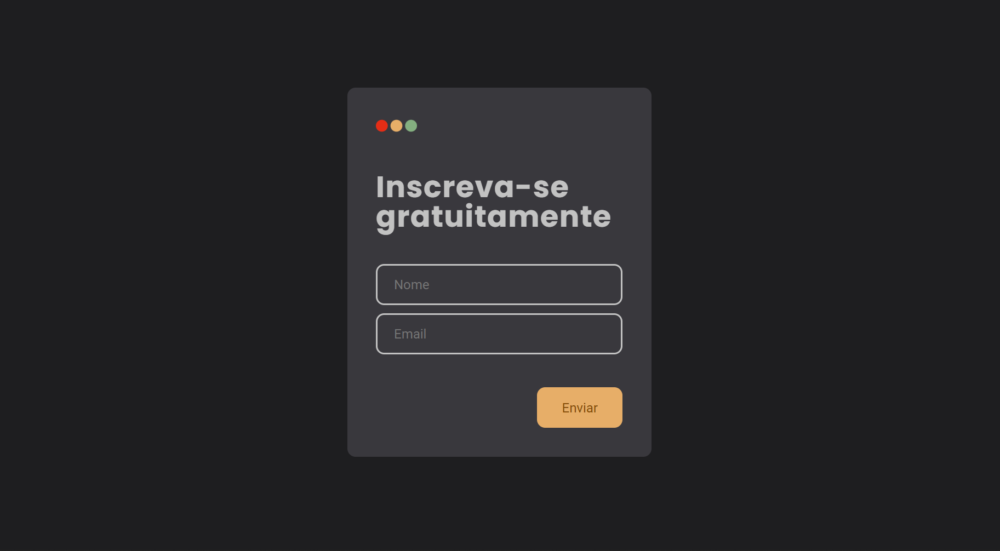

# Formulário de inscrição




> Site de inscrição que dispara envio de mensagem pro endereço de email do usuário

<br>

### Tecnologias e bibliotecas utilizadas

- [x] React.js
- [x] Typescript
- [x] EmailJS
- [x] React-toastify
- [x] Styled Components

<br>

## 💻 Pré-requisitos

Antes de começar, verifique se você atendeu aos seguintes requisitos:
<!---Estes são apenas requisitos de exemplo. Adicionar, duplicar ou remover conforme necessário--->
* Você instalou a versão mais recente de `<node / npm>`
* Você tem uma máquina `<Windows / Linux / Mac>`.

<br>

## ☕ Clonando o projeto

Para clonar o Formulário de inscrição, siga estas etapas, utilize o terminal de sua preferência:

```
git clone https://github.com/EduardaMatias/formulario-inscricao.git
```

~ caminhe até a pasta onde o projeto foi clonado
```
npm i
```
~ aguarde enquanto ocorre a instalação, esse passo pode demorar alguns instantes
```
npm start
```
~ abra [http://localhost:3000](http://localhost:3000) para visualizar em seu navegador

<br>

> ⌨️ com ❤️ por [Eduarda Matias](https://www.linkedin.com/in/eduarda-matias/) 😊

<br>

[⬆ Voltar ao topo](#formulário-de-inscrição)<br>
